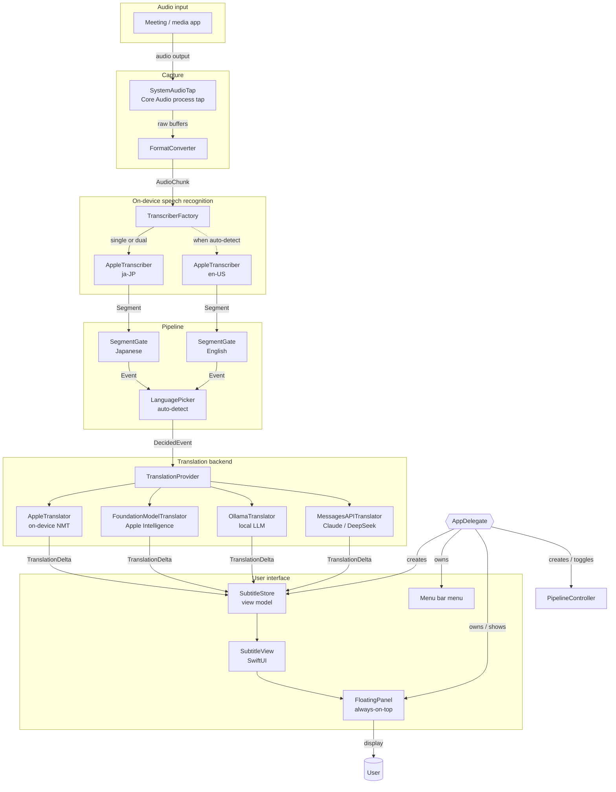
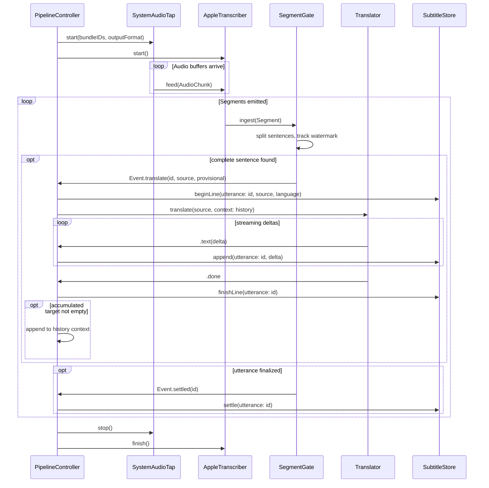
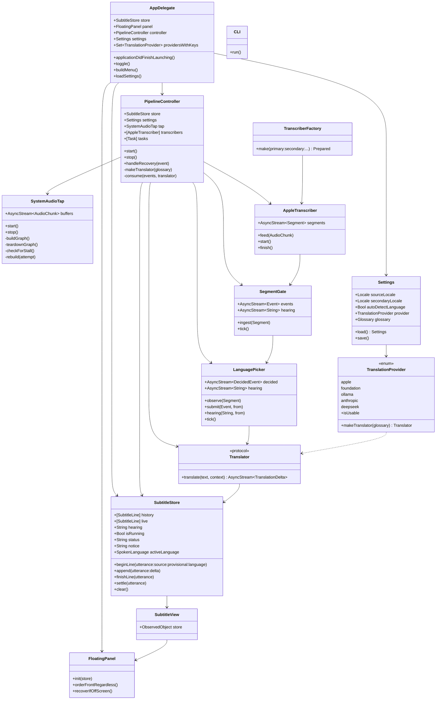
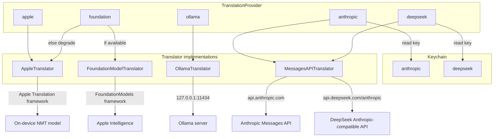
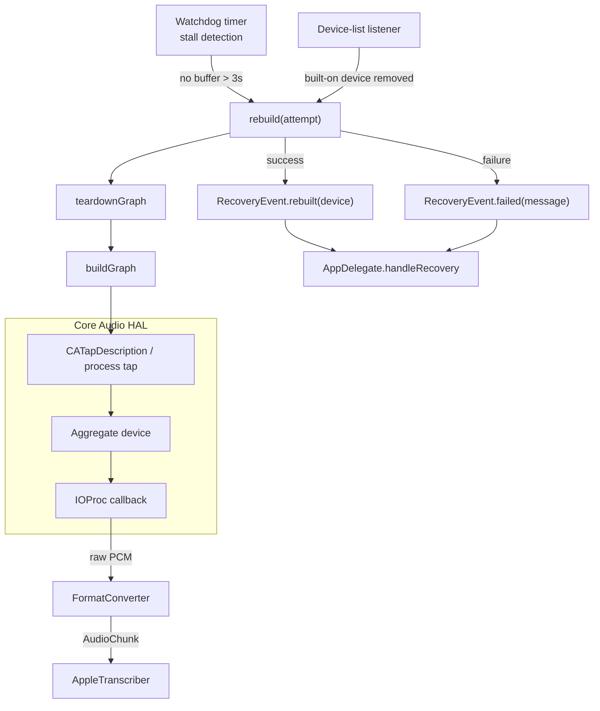
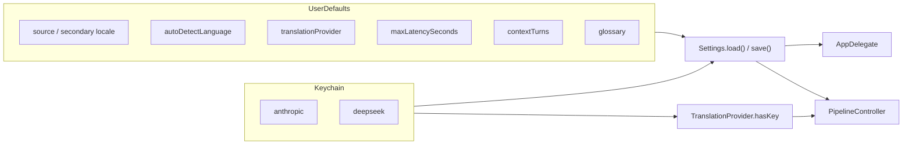
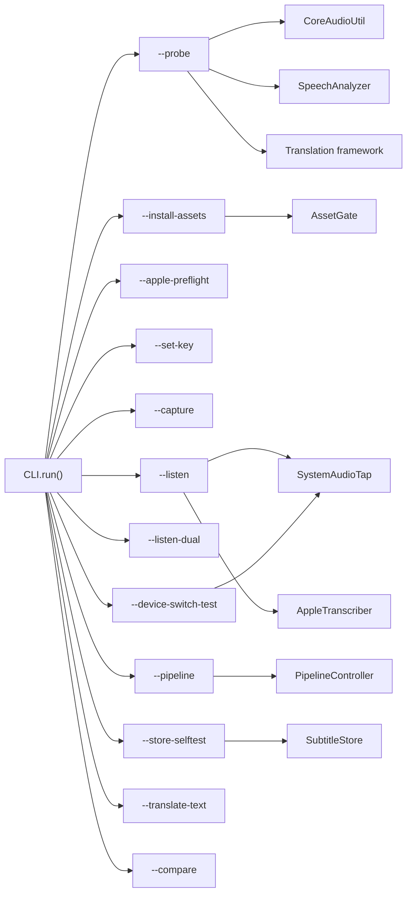

# Tsuyaku Architecture

Tsuyaku is a macOS menu-bar app that captures another application's audio output, transcribes it on-device with Apple's `SpeechAnalyzer`, translates the recognized Japanese into English, and renders the result as a floating, always-on-top subtitle panel.

This document describes the architecture using Mermaid diagrams. All diagrams are also rendered as PNGs in [`docs/assets/`](./assets/) for quick reference.

---

## Table of contents

1. [High-level data flow](#1-high-level-data-flow)
2. [Runtime pipeline single-language mode](#2-runtime-pipeline-single-language-mode)
3. [Runtime pipeline auto-detect mode](#3-runtime-pipeline-auto-detect-mode)
4. [Component responsibilities](#4-component-responsibilities)
5. [Translation provider hierarchy](#5-translation-provider-hierarchy)
6. [Audio capture and recovery](#6-audio-capture-and-recovery)
7. [Configuration and secrets](#7-configuration-and-secrets)
8. [CLI diagnostics](#8-cli-diagnostics)

---

## 1. High-level data flow

---

## 2. Runtime pipeline (single-language mode)

When automatic English detection is **off**, one recognizer runs and every translatable segment is sent straight to the configured translator.

---

## 3. Runtime pipeline (auto-detect mode)

When automatic English detection is **on**, the same audio is fed to both a Japanese and an English recognizer. A `LanguagePicker` decides, per spoken turn, which recognizer to render.

```mermaid
flowchart LR
    Tap["SystemAudioTap"] -->|AudioChunk| Feed["sequential feed"]
    Feed --> JaSTT["AppleTranscriber ja-JP"]
    Feed --> EnSTT["AppleTranscriber en-US"]

    JaSTT -->|Segment| JaGate["SegmentGate ja"]
    EnSTT -->|Segment| EnGate["SegmentGate en"]

    JaSTT -->|hearing text| Picker
    EnSTT -->|hearing text| Picker

    JaGate -->|Event.translate / settled| Picker
    EnGate -->|Event.translate / settled| Picker

    Picker -->|DecidedEvent| Translator
    Translator -->|TranslationDelta| Store["SubtitleStore"]

    Picker -->|hearing| Store

    Store --> Panel["FloatingPanel / SubtitleView"]

    style Picker fill:#2d4a3e,stroke:#4caf50
    style Store fill:#2d3e50,stroke:#2196f3
```

---

## 4. Component responsibilities

---

## 5. Translation provider hierarchy

The app ships with five translation backends. The user's choice is stored in `Settings`; secrets live in the Keychain.

---

## 6. Audio capture and recovery

`SystemAudioTap` builds a Core Audio process tap and aggregate device, converts the audio to the recognizer's expected format, and survives output-device changes (for example, Bluetooth headphones disconnecting).

---

## 7. Configuration and secrets

User settings are persisted in `UserDefaults`. API keys are stored in the Keychain and are never written to defaults.

---

## 8. CLI diagnostics

The same executable can run diagnostic subcommands instead of launching the GUI. These exercise one layer at a time and are useful for verifying setup.

