# Tsuyaku Architecture

Tsuyaku is a macOS menu-bar app that captures another application's audio output, transcribes it on-device with Apple's `SpeechAnalyzer`, translates the recognized Japanese into English, and renders the result as a floating, always-on-top subtitle panel.

A second backend family skips on-device transcription entirely and translates straight from audio to English text: **Qwen Omni**, one request per utterance, and **Gemini Live Translate**, one streaming session for the whole meeting.

**Translate My Voice** runs the other way at the same time. It takes the user's own English from the microphone, translates it into Japanese, and shows it in a second caption panel that colleagues read on the shared screen (§11).

---

## Table of contents

1. [High-level data flow](#1-high-level-data-flow)
2. [Runtime pipeline (single-language STT)](#2-runtime-pipeline-single-language-stt)
3. [Runtime pipeline (auto-detect STT)](#3-runtime-pipeline-auto-detect-stt)
4. [Runtime pipeline (audio-native Qwen Omni)](#4-runtime-pipeline-audio-native-qwen-omni)
5. [Runtime pipeline (live Gemini Translate)](#5-runtime-pipeline-live-gemini-translate)
6. [Component responsibilities](#6-component-responsibilities)
7. [Translation provider hierarchy](#7-translation-provider-hierarchy)
8. [Audio capture and recovery](#8-audio-capture-and-recovery)
9. [Configuration and secrets](#9-configuration-and-secrets)
10. [CLI diagnostics](#10-cli-diagnostics)
11. [Translate My Voice (microphone → Japanese captions)](#11-translate-my-voice-microphone--japanese-captions)

---

## 1. High-level data flow

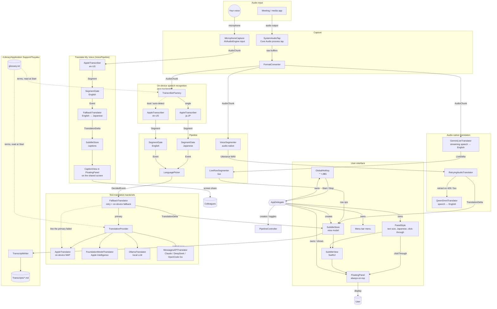

`PipelineController` decides at startup which branch to build:

- Text providers (`apple`, `foundation`, `ollama`, `anthropic`, `deepseek`, `opencodeGo`) build an `AppleTranscriber`-based graph.
- The audio-native providers bypass speech recognition. `qwenOmni` builds a `VoiceSegmenter`-based graph; `geminiLive` streams the audio into one live session with no segmenter at all.

On the text path, the provider's translator is wrapped in a `FallbackTranslator`, with `AppleTranslator` as the fallback. There is no wrapper when the provider's translator already is `AppleTranslator`. Qwen Omni is wrapped in a `RetryingAudioTranslator`, which retries but has no fallback. See [Failure handling](#failure-handling).

Every path ends in `SubtitleStore`, and every row leaves the live pane through one method, `graduate()`. That is where `onSettled` hands the row to `TranscriptWriter`, so the saved transcript covers all backends and is unaffected by the panel's 500-row cap.

---

## 2. Runtime pipeline (single-language STT)

When automatic English detection is **off**, one recognizer runs and every translatable segment is sent to the configured translator.

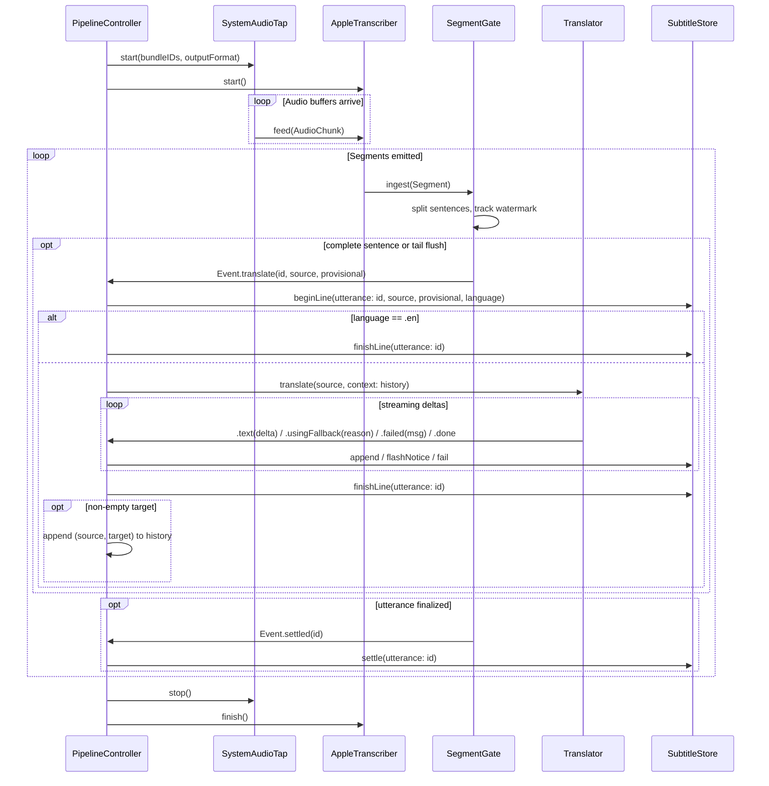

`SegmentGate` cuts only at sentence terminators so that partial Japanese clauses (SOV word order) are not translated before the verb arrives. A `maxLatency` backstop flushes the trailing fragment anyway.

---

## 3. Runtime pipeline (auto-detect STT)

When automatic English detection is **on**, the same audio is fed to both a Japanese and an English recognizer. A `LanguagePicker` decides, per spoken turn, which recognizer to render.

```mermaid
flowchart LR
    Tap["SystemAudioTap"] -->|AudioChunk| Feed["sequential feed"]
    Feed --> JaSTT["AppleTranscriber ja-JP"]
    Feed --> EnSTT["AppleTranscriber en-US"]

    JaSTT -->|Segment| JaGate["SegmentGate ja"]
    EnSTT -->|Segment| EnGate["SegmentGate en"]

    JaSTT -->|hearing text| Picker
    EnSTT -->|hearing text| Picker

    JaGate -->|Event.translate / settled| Picker
    EnGate -->|Event.translate / settled| Picker

    Picker -->|DecidedEvent| Translator
    Translator -->|TranslationDelta| Store["SubtitleStore"]

    Picker -->|hearing| Store

    Store --> Panel["FloatingPanel / SubtitleView"]

    style Picker fill:#2d4a3e,stroke:#4caf50
    style Store fill:#2d3e50,stroke:#2196f3
```

Both gates ingest every segment so their sentence watermarks stay in sync. `LanguagePicker` uses `LanguageScore.japaneseness` to score the Japanese recognizer's text; English turns are shown verbatim without spending translation tokens. Each gate has its own tuning: Japanese uses a 7-second backstop and East-Asian terminators; English uses a 2.5-second backstop and ASCII terminators with abbreviation guards.

---

## 4. Runtime pipeline (audio-native Qwen Omni)

The `qwenOmni` provider skips transcription. Audio is cut into utterances by an energy-based voice-activity detector and sent straight to Qwen Omni on Alibaba Cloud Model Studio.

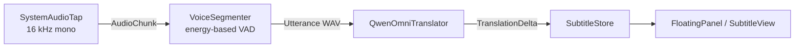

On this path:

- There is no source text; rows carry an empty source and the transcript copy holds English only.
- There is no `hearing` preview, because partial hypotheses are a recognizer feature.
- Auto-detect is inert; the model handles mixed-language speech itself.

---

## 5. Runtime pipeline (live Gemini Translate)

The `geminiLive` provider holds one WebSocket session to `gemini-3.5-live-translate-preview` open for the whole meeting and streams the tap's audio into it continuously, in 100 ms frames of 16 kHz mono PCM. The server returns the source transcript and the English translation as two interleaved streams of fragments.

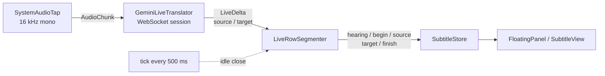

On this path:

- There is no `VoiceSegmenter` and no `SegmentGate`. The model translates as it hears and sends no turn boundaries, so `LiveRowSegmenter` cuts rows from the text: one row per English sentence, closing after 2.5 s of output silence otherwise.
- Source text does exist, streamed back by the server. Source heard between rows shows on the `hearing` line; source heard while a row is open joins that row.
- "Detect English Automatically" becomes the model's `echoTargetLanguage`. With it on, English speech is echoed back verbatim and rendered as an English row; with it off, English produces nothing.
- The glossary and context turns are not used: the translate model accepts no instructions.
- Connections are replaced on `goAway` using session-resumption handles. `GeminiLiveTranslator` keeps up to five seconds of audio buffered across the handover.

---

## 6. Component responsibilities

```mermaid
classDiagram
    direction TB

    class AppDelegate {
        +SubtitleStore store
        +FloatingPanel panel
        +PipelineController controller
        +Settings settings
        +TranslationDownloadHost downloadHost
        +Set~TranslationProvider~ providersWithKeys
        +NSStatusItem statusItem
        +AnyCancellable runningObserver
        +TranscriptWriter transcripts
        +NSMenu? captureMenu
        +PanelStyle style
        +GlobalHotKey? hotKey
        +SubtitleStore captionStore
        +FloatingPanel captionPanel
        +VoicePipeline? voice
        +applicationDidFinishLaunching()
        +toggle()
        +buildMenu()
        +menuNeedsUpdate(menu)
        +loadSettings()
        +rebuildController()
        +selectCaptureSource(item)
        +editGlossary()
        +toggleSaveTranscripts(item)
        +openTranscriptsFolder()
        +selectTextSize(item)
        +toggleShowJapanese(item)
        +toggleClickThrough(item)
        +toggleTranslateMyVoice(item)
        +installModel()
        +copyTranscript()
        +clear()
    }

    class TranscriptWriter {
        +URL directory
        +URL? currentFile
        +begin()
        +append(lines)
        +finish()
    }

    class Glossary {
        +Dictionary entries
        +[String] sourceTerms
        +[String] targetTerms
        +String promptLines
        +parse(text) Glossary
        +loadUser() Glossary
    }

    class PipelineController {
        +SubtitleStore store
        +Settings settings
        +SystemAudioTap? tap
        +[AppleTranscriber] transcribers
        +VoiceSegmenter? segmenter
        +LiveRowSegmenter liveRows
        +[Task] tasks
        +start() async
        +stop()
        +handleRecovery(event)
        -startAudioNative(glossary)
        -startLive(glossary)
        -makeTranslator(glossary) any Translator
        -consume(events, language, using translator)
        -consume(decided, using translator)
        -consume(utterances, using audioTranslator)
        -consume(deltas)
        -tickLive()
        -Bool onFallback
    }

    class SubtitleStore {
        +[SubtitleLine] history
        +[SubtitleLine] live
        +String hearing
        +Bool isRunning
        +String status
        +String? notice
        +SpokenLanguage? activeLanguage
        +Bool autoDetecting
        +Int settledCount
        +Closure onSettled
        +beginLine(utterance:source:provisional:language)
        +append(utterance:delta)
        +appendSource(utterance:delta)
        +apply(ops)
        +fail(utterance:message)
        +finishLine(utterance)
        +settle(utterance)
        +clear()
        +flashNotice(text)
        +headerLabel
        +transcriptMarkdown
    }

    class FloatingPanel {
        +init(store, style)
        +init(content, layout, clickThrough)
        +Layout layout
        +Bool ignoresMouseEvents
        +orderFrontRegardless()
        +recoverIfOffScreen()
        -positionAtBottomCentre()
    }

    class SubtitleView {
        +ObservedObject store
        +ObservedObject style
    }

    class VoicePipeline {
        +SubtitleStore captions
        +TranslationProvider provider
        +start(glossary) async String?
        +stop()
    }

    class MicrophoneCapture {
        +AsyncStream~AudioChunk~ buffers
        +authorize() async Bool
        +start()
        +stop()
    }

    class CaptionView {
        +ObservedObject store
    }

    class TranslationDirection {
        <<enum>>
        japaneseToEnglish
        englishToJapanese
        +String sourceName
        +String targetName
    }

    class PanelStyle {
        +TextSize textSize
        +Bool showJapanese
        +Bool clickThrough
        +init(defaults)
        +showsSource(of line) Bool
    }

    class GlobalHotKey {
        +init(keyCode, modifiers, action)
        +carbonModifiers(flags) UInt32
    }

    class SystemAudioTap {
        +AsyncStream~AudioChunk~ buffers
        +start()
        +stop()
        -createTap()
        -createAggregateDevice()
        -installIOProc()
        -addDefaultDeviceListener()
        -devicesChanged()
        -rebuild(attempt)
        -checkForStall()
        +simulateCaptureLoss()
    }

    class TranscriberFactory {
        <<enum>>
        +Prepared
        +make(primary:secondary:primaryTerms:secondaryTerms:onProgress) Prepared
        +sharedFormat(modules) AVAudioFormat?
    }

    class AppleTranscriber {
        +AVAudioFormat inputFormat
        +SpokenLanguage language
        +AsyncStream~Segment~ segments
        +init(module, language, inputFormat, contextualStrings)
        +init(locale, contextualStrings)
        +start()
        +feed(AudioChunk)
        +finish()
        +analyze(file)
    }

    class SegmentGate {
        +GateConfig config
        +AsyncStream~Event~ events
        +AsyncStream~String~ hearing
        +ingest(Segment)
        +tick()
    }

    class LanguagePicker {
        +AsyncStream~DecidedEvent~ decided
        +AsyncStream~String~ hearing
        +observe(Segment)
        +submit(Event, from)
        +hearing(String, from)
        +tick()
    }

    class PickerState {
        +Tuning tuning
        +choose() Choice
        +submit(Event, from, now) Outcome
        +observe(Segment)
        +tick(now)
    }

    class LanguageScore {
        <<enum>>
        +japaneseness(text) Double
    }

    class Translator {
        <<protocol>>
        +translate(text, context) AsyncStream~TranslationDelta~
    }

    class TranslationDelta {
        <<enum>>
        text(String)
        done
        failed(String, transient)
        usingFallback(String)
    }

    class RetryPolicy {
        +[Duration] delays
        +Duration budget
        +run(attempt, emit) Outcome
    }

    class FallbackTranslator {
        +Translator primary
        +Translator fallback
        +RetryPolicy policy
        +Duration cooldown
        +translate(text, context)
    }

    class RetryingAudioTranslator {
        +AudioTranslator inner
        +RetryPolicy policy
        +translate(audio, context)
    }

    class AudioTranslator {
        <<protocol>>
        +translate(audio: Data, context: [String]) AsyncStream~TranslationDelta~
    }

    class VoiceSegmenter {
        +Config config
        +AsyncStream~Utterance~ utterances
        +feed(AudioChunk)
        +finish()
    }

    class QwenOmniTranslator {
        +String apiKey
        +URL endpoint
        +String model
        +translate(audio, context)
    }

    class LiveTranslator {
        <<protocol>>
        +translate(audio: AsyncStream~AudioChunk~) AsyncStream~LiveDelta~
    }

    class GeminiLiveTranslator {
        +String apiKey
        +String model
        +Bool echoTargetLanguage
        +translate(audio)
    }

    class LiveRowSegmenter {
        +Tuning tuning
        +ingest(LiveDelta, now) [Op]
        +tick(now) [Op]
        +flush() [Op]
    }

    class Settings {
        +Locale sourceLocale
        +Locale secondaryLocale
        +Bool autoDetectLanguage
        +Int englishMaxLatencyMillis
        +Double languageThreshold
        +Bool confidenceTiebreak
        +[String] targetBundleIDs
        +Int maxLatencySeconds
        +Int contextTurns
        +TranslationProvider provider
        +Bool saveTranscripts
        +static String omniModel
        +static String opencodeModel
        +static String geminiModel
        +load() Settings
        +save()
    }

    class TranslationProvider {
        <<enum>>
        apple
        foundation
        ollama
        anthropic
        deepseek
        opencodeGo
        qwenOmni
        geminiLive
        +String shortName
        +String? keychainAccount
        +Bool needsKey
        +Bool hasKey
        +String? unusableReason
        +Bool isAudioNative
        +Bool isLiveStream
        +Bool isUsable
        +makeTranslator(glossary) any Translator
        +makeAudioTranslator(glossary) any AudioTranslator?
        +makeLiveTranslator(echoEnglish) any LiveTranslator?
    }

    class TranslationDownloadHost {
        +present()
    }

    class CLI {
        +run() async
    }

    AppDelegate --> PipelineController
    AppDelegate --> SubtitleStore
    AppDelegate --> FloatingPanel
    AppDelegate --> Settings
    AppDelegate --> TranslationDownloadHost
    AppDelegate --> TranscriptWriter
    AppDelegate --> PanelStyle
    AppDelegate --> VoicePipeline
    VoicePipeline --> MicrophoneCapture
    VoicePipeline --> AppleTranscriber
    VoicePipeline --> SegmentGate
    VoicePipeline --> Translator
    VoicePipeline --> SubtitleStore
    CaptionView --> SubtitleStore
    CaptionView --> FloatingPanel
    Translator ..> TranslationDirection
    AppDelegate --> GlobalHotKey
    PanelStyle <.. SubtitleView
    PanelStyle <.. FloatingPanel
    SubtitleStore ..> TranscriptWriter : onSettled
    PipelineController ..> Glossary : loadUser at Start

    PipelineController --> SystemAudioTap
    PipelineController --> AppleTranscriber
    PipelineController --> SegmentGate
    PipelineController --> LanguagePicker
    PipelineController --> Translator
    PipelineController --> AudioTranslator
    PipelineController --> VoiceSegmenter
    PipelineController --> LiveTranslator
    PipelineController --> LiveRowSegmenter
    PipelineController --> SubtitleStore

    TranscriberFactory --> AppleTranscriber
    AppleTranscriber --> SegmentGate
    SegmentGate --> LanguagePicker
    LanguagePicker --> Translator
    Translator --> SubtitleStore
    Translator ..> TranslationDelta
    Translator <|.. FallbackTranslator
    FallbackTranslator --> Translator : primary, fallback
    FallbackTranslator --> RetryPolicy
    AudioTranslator <|.. RetryingAudioTranslator
    RetryingAudioTranslator --> AudioTranslator : inner
    RetryingAudioTranslator --> RetryPolicy
    AudioTranslator --> SubtitleStore
    LiveTranslator <|.. GeminiLiveTranslator
    LiveRowSegmenter --> SubtitleStore
    SubtitleStore --> SubtitleView
    SubtitleView --> FloatingPanel

    TranslationProvider ..> Translator
    TranslationProvider ..> AudioTranslator
    TranslationProvider ..> LiveTranslator
    Settings --> TranslationProvider
```

---

## 7. Translation provider hierarchy

The app ships with seven providers. The user's choice is stored in `Settings`; API keys live in the Keychain.

```mermaid
flowchart TB
    subgraph Keychain["Keychain"]
        AnthropicKey["anthropic"]
        DeepSeekKey["deepseek"]
        OpenCodeGoKey["opencodeGo"]
        DashscopeKey["dashscope"]
        GeminiKey["gemini"]
    end

    subgraph Providers["TranslationProvider"]
        Apple["apple"]
        Foundation["foundation"]
        Ollama["ollama"]
        Anthropic["anthropic"]
        DeepSeek["deepseek"]
        OpenCodeGo["opencodeGo"]
        QwenOmni["qwenOmni"]
        GeminiLive["geminiLive"]
    end

    subgraph Backends["Translator implementations"]
        AT["AppleTranslator"]
        FMT["FoundationModelTranslator"]
        OT["OllamaTranslator"]
        MAT["MessagesAPITranslator"]
        QT["QwenOmniTranslator"]
        GLT["GeminiLiveTranslator"]
    end

    Apple --> AT
    Foundation -->|if available| FMT
    Foundation -->|else degrade| AT
    Ollama --> OT
    Anthropic -->|read key| AnthropicKey
    Anthropic --> MAT
    DeepSeek -->|read key| DeepSeekKey
    DeepSeek --> MAT
    OpenCodeGo -->|read key| OpenCodeGoKey
    OpenCodeGo --> MAT
    QwenOmni -->|read key| DashscopeKey
    QwenOmni --> QT
    GeminiLive -->|read key| GeminiKey
    GeminiLive --> GLT

    MAT -->|api.anthropic.com| AnthropicCloud["Anthropic Messages API"]
    MAT -->|api.deepseek.com/anthropic| DeepSeekCloud["DeepSeek Anthropic-compatible API"]
    MAT -->|opencode.ai/zen/go| OpenCodeGoCloud["OpenCode Go Messages API"]
    QT -->|dashscope-intl.aliyuncs.com| QwenCloud["Qwen Omni API"]
    GLT -->|wss generativelanguage.googleapis.com| GeminiCloud["Gemini Live API"]
    OT -->|127.0.0.1:11434| OllamaServer["Ollama server"]
    AT -->|Apple Translation framework| OnDeviceNMT["On-device NMT model"]
    FMT -->|FoundationModels framework| AppleIntelligence["Apple Intelligence"]
```

`TranslationProvider.isUsable` checks more than key presence: it probes Ollama reachability and Apple Intelligence availability so unavailable backends are greyed out in the menu instead of silently degrading.

Every text backend takes a `TranslationDirection`, which defaults to Japanese → English. `InterpreterPrompt` keeps one set of style rules per direction. The Japanese → English prompt is byte-identical to the one before directions existed, and a self-test holds it there. Translate My Voice asks for English → Japanese with the glossary reversed (`Glossary.reversed`). Qwen Omni and Gemini Live only produce English, so when either is selected, `TranslationProvider.voiceProvider` picks the first usable keyed text backend for the captions, or Apple NMT.

### Failure handling

Backends report each failure with `.failed(message, transient:)`. A failure is `transient` when sending the same request again has a fair chance of working:

- HTTP 408, 429, 500, 502, 503, 504 or 529.
- An SSE `overloaded_error`, `rate_limit_error` or `api_error`.
- A dropped, refused or timed-out connection (`TransientFailure`).

`FallbackTranslator` sits between the pipeline and the text backend and handles each line in three steps:

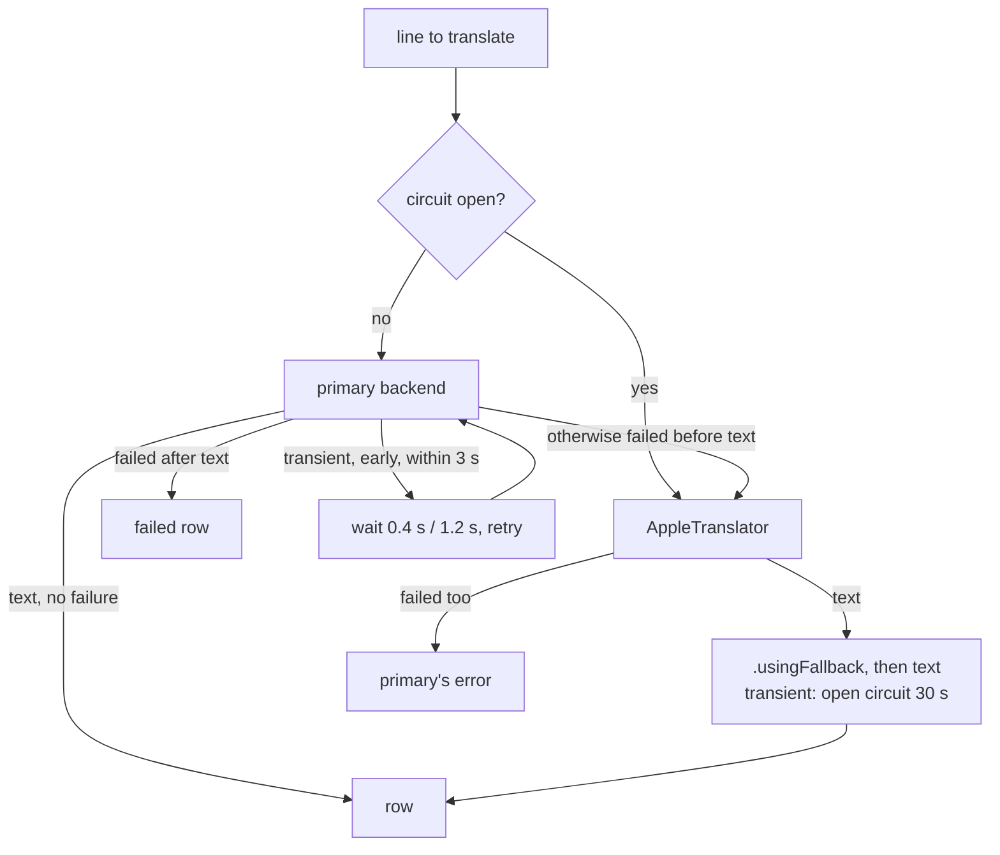

1. **Retry.** A retry happens only before any text has streamed, so a line is never translated twice. It also happens only while the line is less than 3 s old (`RetryPolicy.budget`): a 429 that fails in 200 ms is retried, but a 10 s timeout is not.
2. **Fall back.** If the primary still fails before any text, the line goes to on-device NMT. `.usingFallback(reason)` comes before the fallback's text. `PipelineController` turns it into a single header notice ("Claude unavailable — translating on-device"), then "Claude is back" when a row next comes from the primary. If the fallback fails too, the row shows the primary's error.
3. **Circuit.** A transient failure that the fallback covered opens a circuit for 30 s. During that time, lines go straight to NMT and pay no retries. After it, one line probes the primary with no retries. The circuit opens only when the fallback worked, so a Mac without the Japanese NMT model keeps trying the primary.

Non-transient failures (a bad key, an on-device LLM refusal, an empty reply) fall back for that line only.

Qwen Omni gets the same retries through `RetryingAudioTranslator` but has no fallback: nothing transcribes its audio, so there is no text to give NMT. Gemini Live reconnects on its own (§5).

---

## 8. Audio capture and recovery

`SystemAudioTap` builds a Core Audio process tap and aggregate device, converts the audio to the downstream format, and survives output-device changes (for example, Bluetooth headphones disconnecting).

The aggregate device needs a real output device as its clock. It uses the Mac's built-in output (`CA.builtInOutputDevice`), and falls back to the default output only on a Mac that has none. The tap captures apps' audio before it reaches any device, so the clock doesn't have to be what the user is listening on.

A Bluetooth headset is a poor clock. When any app opens its microphone, for example a Meet call or Translate My Voice, the headset switches to the hands-free profile and changes rate and shape. Built on HUAWEI FreeClip 2 with its microphone open, the IOProc stopped firing for good, and the watchdog rebuilt the graph every four seconds without ever getting audio back.

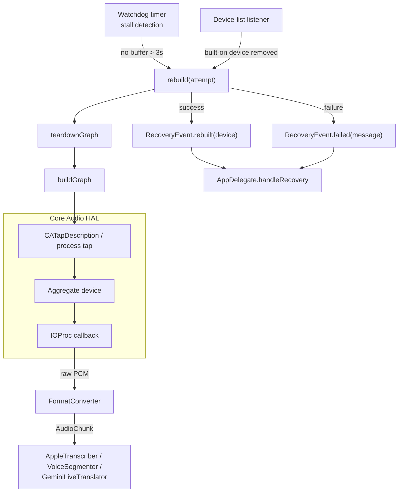

The user's own voice doesn't come through the tap: a meeting app never plays it back. `MicrophoneCapture` reads it from the default input device with `AVAudioEngine` and passes it through the same `FormatConverter`. When the default input changes, for example when a headset is plugged in, the engine posts `AVAudioEngineConfigurationChange`; the capture then rebuilds the converter for the new format and restarts. There is no voice processing, because its echo cancellation would also duck the meeting audio the tap is capturing. Headphones are the answer to echo.

The tap can target a single bundle ID or all system audio except the app itself (`bundleIDs == []`). The user chooses from the **Capture From** menu. It is refilled from `CA.runningOutputBundleIDs()` each time it opens and always lists the saved choice, even when that app is quiet or not running. `isProcessRestoreEnabled` reattaches the tap when that app relaunches. Changing the choice mid-meeting cycles the pipeline through `rebuildController()`. The `buffers` stream survives rebuilds; only `stop()` finishes it.

---

## 9. Configuration and secrets

User settings are persisted in `UserDefaults`. API keys are stored in the Keychain and are never written to defaults. On first launch, `Settings.load` prefers a configured cloud backend over the on-device Apple translator.

The panel's own preferences (**Text Size**, **Show Japanese**, **Click-Through**) are in `UserDefaults` too, but through `PanelStyle` rather than `Settings`. `Settings` is a value copied into `PipelineController`, so a change to it cycles the pipeline, and SwiftUI can't observe it. `PanelStyle` is an `ObservableObject` that the panel and its view watch. Changes apply instantly, capture keeps running, and each one is saved as it happens. Transcripts, saved and copied, keep both languages whatever the panel shows.

The Start/Stop shortcut, ⌃⌥⌘S, is fixed and registered with Carbon's `RegisterEventHotKey` (`GlobalHotKey`). It is the one system-wide shortcut API that needs no Accessibility permission. If another app already holds the combination, registration fails, and the menu shows the plain ⌘S instead.

Two things the user owns live as files under `~/Library/Application Support/Tsuyaku` (`AppPaths`). That folder is used rather than `~/Documents`, which would trigger a macOS folder-access prompt.

- **`glossary.txt`**: one `Japanese = English` per line, `#` for comments; full-width `＝` is accepted. **Edit Glossary…** creates it with a starter and opens it in the default text editor. It is not a setting: `PipelineController.start()` re-reads it through `Glossary.loadUser()` at every Start. Source terms bias the Japanese recognizer, target terms bias the English one, and the entries go into every LLM prompt. Gemini Live takes no instructions, so there the panel says the glossary is unused.
- **`Transcripts/*.md`**: one file per session, from the user's Start to their Stop, opened on the first settled row and created `0600`. Pipeline restarts for settings changes stay in the same file. At Stop, rows still in the live pane are written once, and rows arriving outside a session or already written are dropped. That covers a translation cancelled by Stop that settles a moment later. **Save Transcripts** (on by default) turns this off.

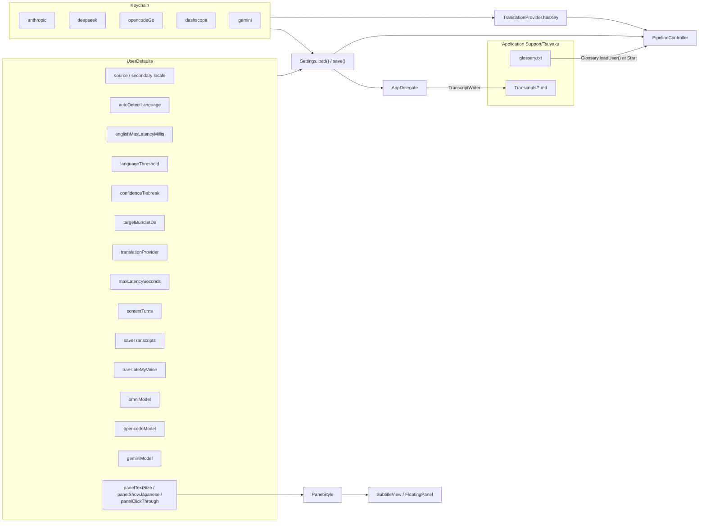

---

## 10. CLI diagnostics

The same executable can run diagnostic subcommands instead of launching the GUI. These exercise one layer at a time and are useful for verifying setup.

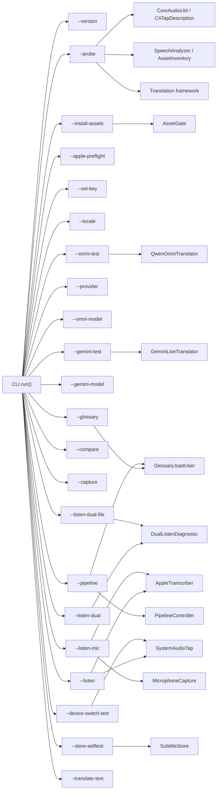

`--apple-preflight` checks both on-device directions: Japanese → English for the subtitles, and English → Japanese for Translate My Voice's fallback. `--listen-mic [s]` runs Translate My Voice without the panel. It prints each recognized English sentence and its Japanese translation, which is the quickest way to judge how well the recognizer hears a particular speaker.

---

## 11. Translate My Voice (microphone → Japanese captions)

For a user who speaks English to Japanese colleagues. Google Meet and similar apps have no API for putting captions into the call, but everything on an "Entire screen" share reaches every participant. So the captions are a window on the shared screen.

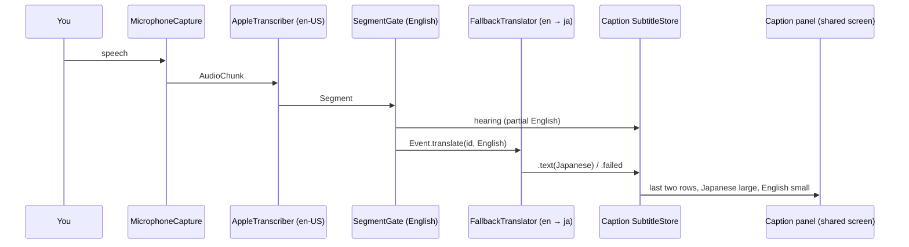

- **Independent of the subtitles.** `VoicePipeline` shares no runtime state with `PipelineController`: it has its own audio, recognizer, gate, translator, context history and store. It starts and stops with Start/Stop and ⌃⌥⌘S when **Translate My Voice** is on. Toggling it mid-meeting leaves the subtitles running, and a provider change relaunches it without hiding the caption panel.
- **Built for an audience.** `CaptionView` has no history and no scrolling, because nobody watching a share can scroll. It shows the last two rows (`CaptionRows.visible`). A failed row keeps its English and shows no error message; the error is logged.
- **The user's own panel stays private.** While the captions run, the subtitle panel has `sharingType = .none`, so a full-screen share shows only the captions. Whether a given capture path honours that is up to the capturing app.
- **Placement is remembered.** The caption panel uses `FloatingPanel.Layout.captions`, which keeps its origin across launches, unlike the subtitle panel. Where it sits inside the shared area is a deliberate choice.
- **Headphones.** Without them the microphone also hears colleagues through the speakers, and the English recognizer turns their Japanese into nonsense captions.
