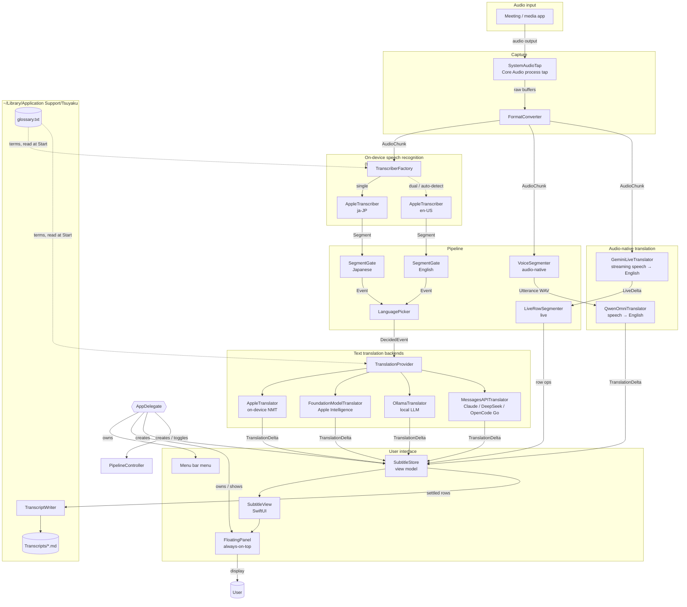
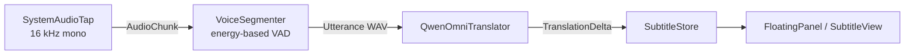
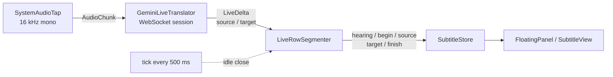
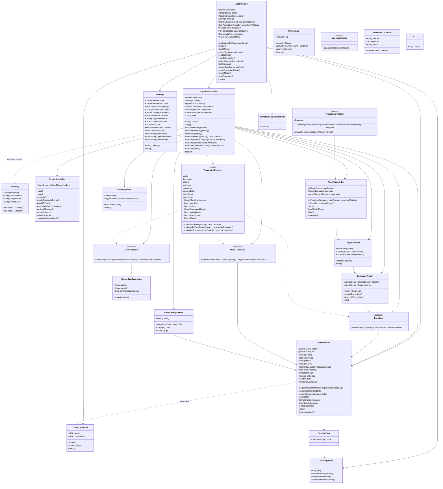
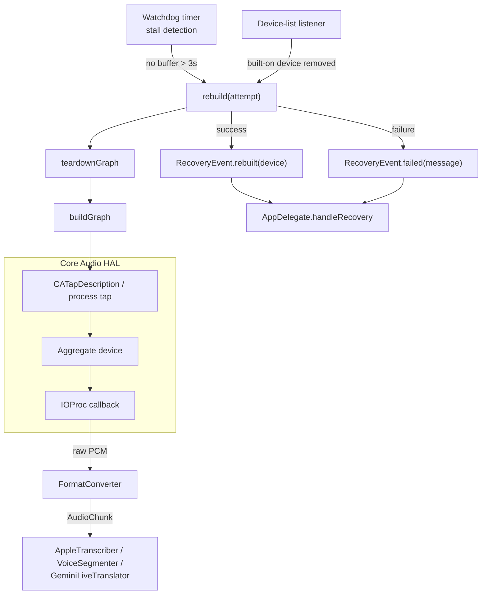
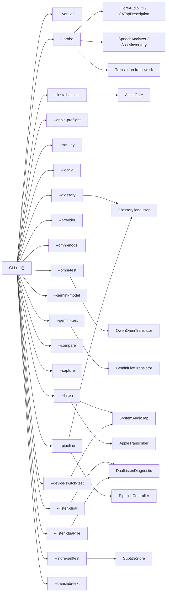

# Tsuyaku Architecture

Tsuyaku is a macOS menu-bar app that captures another application's audio output, transcribes it on-device with Apple's `SpeechAnalyzer`, translates the recognized Japanese into English, and renders the result as a floating, always-on-top subtitle panel.

A second backend family skips on-device transcription entirely and translates straight from audio to English text: **Qwen Omni**, one request per utterance, and **Gemini Live Translate**, one streaming session for the whole meeting.

---

## Table of contents

1. [High-level data flow](#1-high-level-data-flow)
2. [Runtime pipeline (single-language STT)](#2-runtime-pipeline-single-language-stt)
3. [Runtime pipeline (auto-detect STT)](#3-runtime-pipeline-auto-detect-stt)
4. [Runtime pipeline (audio-native Qwen Omni)](#4-runtime-pipeline-audio-native-qwen-omni)
5. [Runtime pipeline (live Gemini Translate)](#5-runtime-pipeline-live-gemini-translate)
6. [Component responsibilities](#6-component-responsibilities)
7. [Translation provider hierarchy](#7-translation-provider-hierarchy)
8. [Audio capture and recovery](#8-audio-capture-and-recovery)
9. [Configuration and secrets](#9-configuration-and-secrets)
10. [CLI diagnostics](#10-cli-diagnostics)

---

## 1. High-level data flow

`PipelineController` decides at startup which branch to build:

- Text providers (`apple`, `foundation`, `ollama`, `anthropic`, `deepseek`, `opencodeGo`) build an `AppleTranscriber`-based graph.
- The audio-native providers bypass speech recognition. `qwenOmni` builds a `VoiceSegmenter`-based graph; `geminiLive` streams the audio into one live session with no segmenter at all.

Every path ends in `SubtitleStore`, and every row leaves the live pane through one method, `graduate()`. That is where `onSettled` hands the row to `TranscriptWriter`, so the saved transcript covers all backends and is unaffected by the panel's 500-row cap.

---

## 2. Runtime pipeline (single-language STT)

When automatic English detection is **off**, one recognizer runs and every translatable segment is sent to the configured translator.

```mermaid
sequenceDiagram
    participant PC as PipelineController
    participant Tap as SystemAudioTap
    participant STT as AppleTranscriber
    participant Gate as SegmentGate
    participant T as Translator
    participant Store as SubtitleStore

    PC->>Tap: start(bundleIDs, outputFormat)
    PC->>STT: start()

    loop Audio buffers arrive
        Tap->>STT: feed(AudioChunk)
    end

    loop Segments emitted
        STT->>Gate: ingest(Segment)
        Gate->>Gate: split sentences, track watermark
        opt complete sentence or tail flush
            Gate->>PC: Event.translate(id, source, provisional)
            PC->>Store: beginLine(utterance: id, source, provisional, language)
            alt language == .en
                PC->>Store: finishLine(utterance: id)
            else
                PC->>T: translate(source, context: history)
                loop streaming deltas
                    T->>PC: .text(delta) / .failed(msg) / .done
                    PC->>Store: append / fail
                end
                PC->>Store: finishLine(utterance: id)
                opt non-empty target
                    PC->>PC: append (source, target) to history
                end
            end
        end
        opt utterance finalized
            Gate->>PC: Event.settled(id)
            PC->>Store: settle(utterance: id)
        end
    end

    PC->>Tap: stop()
    PC->>STT: finish()
```

`SegmentGate` cuts only at sentence terminators so that partial Japanese clauses (SOV word order) are not translated before the verb arrives. A `maxLatency` backstop flushes the trailing fragment anyway.

---

## 3. Runtime pipeline (auto-detect STT)

When automatic English detection is **on**, the same audio is fed to both a Japanese and an English recognizer. A `LanguagePicker` decides, per spoken turn, which recognizer to render.

```mermaid
flowchart LR
    Tap["SystemAudioTap"] -->|AudioChunk| Feed["sequential feed"]
    Feed --> JaSTT["AppleTranscriber ja-JP"]
    Feed --> EnSTT["AppleTranscriber en-US"]

    JaSTT -->|Segment| JaGate["SegmentGate ja"]
    EnSTT -->|Segment| EnGate["SegmentGate en"]

    JaSTT -->|hearing text| Picker
    EnSTT -->|hearing text| Picker

    JaGate -->|Event.translate / settled| Picker
    EnGate -->|Event.translate / settled| Picker

    Picker -->|DecidedEvent| Translator
    Translator -->|TranslationDelta| Store["SubtitleStore"]

    Picker -->|hearing| Store

    Store --> Panel["FloatingPanel / SubtitleView"]

    style Picker fill:#2d4a3e,stroke:#4caf50
    style Store fill:#2d3e50,stroke:#2196f3
```

Both gates ingest every segment so their sentence watermarks stay in sync. `LanguagePicker` uses `LanguageScore.japaneseness` to score the Japanese recognizer's text; English turns are shown verbatim without spending translation tokens. Each gate has its own tuning: Japanese uses a 7-second backstop and East-Asian terminators; English uses a 2.5-second backstop and ASCII terminators with abbreviation guards.

---

## 4. Runtime pipeline (audio-native Qwen Omni)

The `qwenOmni` provider skips transcription. Audio is cut into utterances by an energy-based voice-activity detector and sent straight to Qwen Omni on Alibaba Cloud Model Studio.

On this path:

- There is no source text; rows carry an empty source and the transcript copy holds English only.
- There is no `hearing` preview, because partial hypotheses are a recognizer feature.
- Auto-detect is inert; the model handles mixed-language speech itself.

---

## 5. Runtime pipeline (live Gemini Translate)

The `geminiLive` provider holds one WebSocket session to `gemini-3.5-live-translate-preview` open for the whole meeting and streams the tap's audio into it continuously, in 100 ms frames of 16 kHz mono PCM. The server returns the source transcript and the English translation as two interleaved streams of fragments.

On this path:

- There is no `VoiceSegmenter` and no `SegmentGate`. The model translates as it hears and sends no turn boundaries, so `LiveRowSegmenter` cuts rows from the text: one row per English sentence, closing after 2.5 s of output silence otherwise.
- Source text does exist, streamed back by the server. Source heard between rows shows on the `hearing` line; source heard while a row is open joins that row.
- "Detect English Automatically" becomes the model's `echoTargetLanguage`. With it on, English speech is echoed back verbatim and rendered as an English row; with it off, English produces nothing.
- The glossary and context turns are not used: the translate model accepts no instructions.
- Connections are replaced on `goAway` using session-resumption handles. `GeminiLiveTranslator` keeps up to five seconds of audio buffered across the handover.

---

## 6. Component responsibilities

---

## 7. Translation provider hierarchy

The app ships with seven providers. The user's choice is stored in `Settings`; API keys live in the Keychain.

```mermaid
flowchart TB
    subgraph Keychain["Keychain"]
        AnthropicKey["anthropic"]
        DeepSeekKey["deepseek"]
        OpenCodeGoKey["opencodeGo"]
        DashscopeKey["dashscope"]
        GeminiKey["gemini"]
    end

    subgraph Providers["TranslationProvider"]
        Apple["apple"]
        Foundation["foundation"]
        Ollama["ollama"]
        Anthropic["anthropic"]
        DeepSeek["deepseek"]
        OpenCodeGo["opencodeGo"]
        QwenOmni["qwenOmni"]
        GeminiLive["geminiLive"]
    end

    subgraph Backends["Translator implementations"]
        AT["AppleTranslator"]
        FMT["FoundationModelTranslator"]
        OT["OllamaTranslator"]
        MAT["MessagesAPITranslator"]
        QT["QwenOmniTranslator"]
        GLT["GeminiLiveTranslator"]
    end

    Apple --> AT
    Foundation -->|if available| FMT
    Foundation -->|else degrade| AT
    Ollama --> OT
    Anthropic -->|read key| AnthropicKey
    Anthropic --> MAT
    DeepSeek -->|read key| DeepSeekKey
    DeepSeek --> MAT
    OpenCodeGo -->|read key| OpenCodeGoKey
    OpenCodeGo --> MAT
    QwenOmni -->|read key| DashscopeKey
    QwenOmni --> QT
    GeminiLive -->|read key| GeminiKey
    GeminiLive --> GLT

    MAT -->|api.anthropic.com| AnthropicCloud["Anthropic Messages API"]
    MAT -->|api.deepseek.com/anthropic| DeepSeekCloud["DeepSeek Anthropic-compatible API"]
    MAT -->|opencode.ai/zen/go| OpenCodeGoCloud["OpenCode Go Messages API"]
    QT -->|dashscope-intl.aliyuncs.com| QwenCloud["Qwen Omni API"]
    GLT -->|wss generativelanguage.googleapis.com| GeminiCloud["Gemini Live API"]
    OT -->|127.0.0.1:11434| OllamaServer["Ollama server"]
    AT -->|Apple Translation framework| OnDeviceNMT["On-device NMT model"]
    FMT -->|FoundationModels framework| AppleIntelligence["Apple Intelligence"]
```

`TranslationProvider.isUsable` checks more than key presence: it probes Ollama reachability and Apple Intelligence availability so unavailable backends are greyed out in the menu instead of silently degrading.

---

## 8. Audio capture and recovery

`SystemAudioTap` builds a Core Audio process tap and aggregate device, converts the audio to the downstream format, and survives output-device changes (for example, Bluetooth headphones disconnecting).

The tap can target a single bundle ID or all system audio except the app itself (`bundleIDs == []`). The user chooses from the **Capture From** menu. It is refilled from `CA.runningOutputBundleIDs()` each time it opens and always lists the saved choice, even when that app is quiet or not running. `isProcessRestoreEnabled` reattaches the tap when that app relaunches. Changing the choice mid-meeting cycles the pipeline through `rebuildController()`. The `buffers` stream survives rebuilds; only `stop()` finishes it.

---

## 9. Configuration and secrets

User settings are persisted in `UserDefaults`. API keys are stored in the Keychain and are never written to defaults. On first launch, `Settings.load` prefers a configured cloud backend over the on-device Apple translator.

Two things the user owns live as files under `~/Library/Application Support/Tsuyaku` (`AppPaths`). That folder is used rather than `~/Documents`, which would trigger a macOS folder-access prompt.

- **`glossary.txt`**: one `Japanese = English` per line, `#` for comments; full-width `＝` is accepted. **Edit Glossary…** creates it with a starter and opens it in the default text editor. It is not a setting: `PipelineController.start()` re-reads it through `Glossary.loadUser()` at every Start. Source terms bias the Japanese recognizer, target terms bias the English one, and the entries go into every LLM prompt. Gemini Live takes no instructions, so there the panel says the glossary is unused.
- **`Transcripts/*.md`**: one file per session, from the user's Start to their Stop, opened on the first settled row and created `0600`. Pipeline restarts for settings changes stay in the same file. At Stop, rows still in the live pane are written once, and rows arriving outside a session or already written are dropped. That covers a translation cancelled by Stop that settles a moment later. **Save Transcripts** (on by default) turns this off.

```mermaid
flowchart LR
    subgraph UserDefaults["UserDefaults"]
        Locales["source / secondary locale"]
        Detect["autoDetectLanguage"]
        EnglishLatency["englishMaxLatencyMillis"]
        Threshold["languageThreshold"]
        Tiebreak["confidenceTiebreak"]
        Bundles["targetBundleIDs"]
        Provider["translationProvider"]
        Latency["maxLatencySeconds"]
        Context["contextTurns"]
        SaveTranscripts["saveTranscripts"]
        OmniModel["omniModel"]
        OpenCodeModel["opencodeModel"]
        GeminiModel["geminiModel"]
    end

    subgraph Keychain["Keychain"]
        Anthropic["anthropic"]
        DeepSeek["deepseek"]
        OpenCodeGo["opencodeGo"]
        Dashscope["dashscope"]
        Gemini["gemini"]
    end

    subgraph Support["Application Support/Tsuyaku"]
        GlossaryFile["glossary.txt"]
        TranscriptFiles["Transcripts/*.md"]
    end

    UserDefaults --> Settings["Settings.load() / save()"]
    Keychain --> Settings
    Keychain --> TranslationProvider["TranslationProvider.hasKey"]

    Settings --> AppDelegate["AppDelegate"]
    Settings --> PipelineController["PipelineController"]
    TranslationProvider --> PipelineController
    GlossaryFile -->|"Glossary.loadUser() at Start"| PipelineController
    AppDelegate -->|TranscriptWriter| TranscriptFiles
```

---

## 10. CLI diagnostics

The same executable can run diagnostic subcommands instead of launching the GUI. These exercise one layer at a time and are useful for verifying setup.

