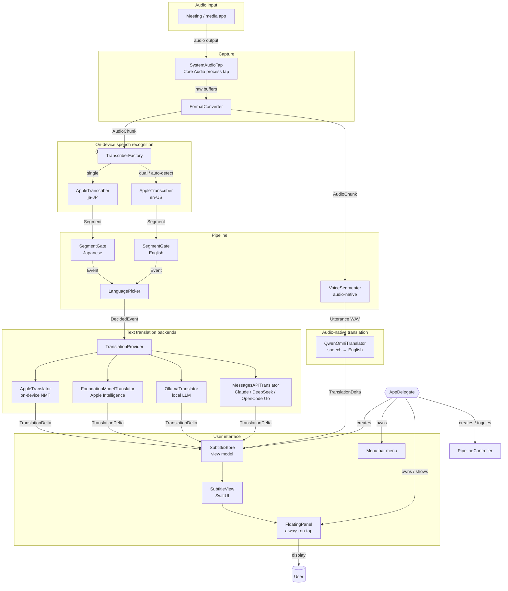
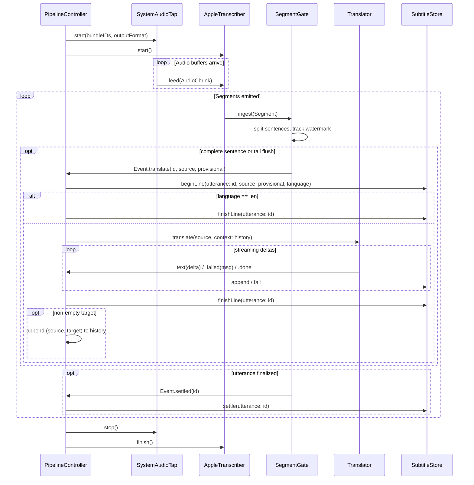
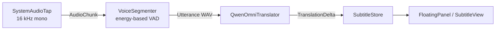
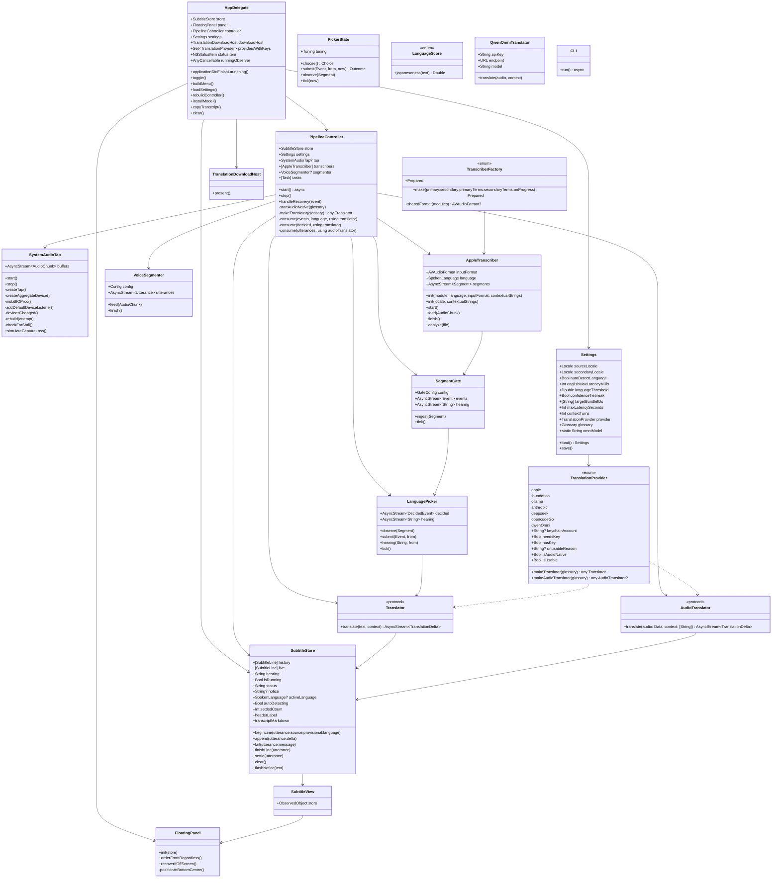
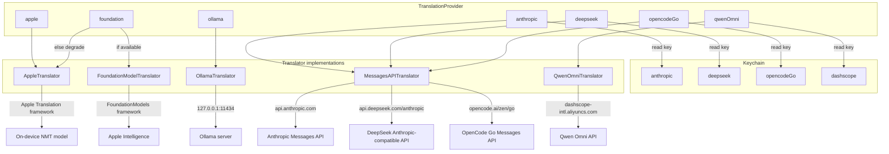
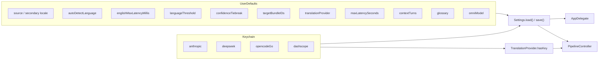
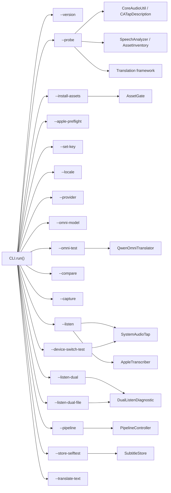

# Tsuyaku Architecture

Tsuyaku is a macOS menu-bar app that captures another application's audio output, transcribes it on-device with Apple's `SpeechAnalyzer`, translates the recognized Japanese into English, and renders the result as a floating, always-on-top subtitle panel.

A second backend family, **Qwen Omni**, skips transcription entirely and translates straight from audio to English text.

---

## Table of contents

1. [High-level data flow](#1-high-level-data-flow)
2. [Runtime pipeline (single-language STT)](#2-runtime-pipeline-single-language-stt)
3. [Runtime pipeline (auto-detect STT)](#3-runtime-pipeline-auto-detect-stt)
4. [Runtime pipeline (audio-native Qwen Omni)](#4-runtime-pipeline-audio-native-qwen-omni)
5. [Component responsibilities](#5-component-responsibilities)
6. [Translation provider hierarchy](#6-translation-provider-hierarchy)
7. [Audio capture and recovery](#7-audio-capture-and-recovery)
8. [Configuration and secrets](#8-configuration-and-secrets)
9. [CLI diagnostics](#9-cli-diagnostics)

---

## 1. High-level data flow

`PipelineController` decides at startup which branch to build:

- Text providers (`apple`, `foundation`, `ollama`, `anthropic`, `deepseek`, `opencodeGo`) build an `AppleTranscriber`-based graph.
- The audio-native provider (`qwenOmni`) builds a `VoiceSegmenter`-based graph instead and bypasses speech recognition.

---

## 2. Runtime pipeline (single-language STT)

When automatic English detection is **off**, one recognizer runs and every translatable segment is sent to the configured translator.

`SegmentGate` cuts only at sentence terminators so that partial Japanese clauses (SOV word order) are not translated before the verb arrives. A `maxLatency` backstop flushes the trailing fragment anyway.

---

## 3. Runtime pipeline (auto-detect STT)

When automatic English detection is **on**, the same audio is fed to both a Japanese and an English recognizer. A `LanguagePicker` decides, per spoken turn, which recognizer to render.

```mermaid
flowchart LR
    Tap["SystemAudioTap"] -->|AudioChunk| Feed["sequential feed"]
    Feed --> JaSTT["AppleTranscriber ja-JP"]
    Feed --> EnSTT["AppleTranscriber en-US"]

    JaSTT -->|Segment| JaGate["SegmentGate ja"]
    EnSTT -->|Segment| EnGate["SegmentGate en"]

    JaSTT -->|hearing text| Picker
    EnSTT -->|hearing text| Picker

    JaGate -->|Event.translate / settled| Picker
    EnGate -->|Event.translate / settled| Picker

    Picker -->|DecidedEvent| Translator
    Translator -->|TranslationDelta| Store["SubtitleStore"]

    Picker -->|hearing| Store

    Store --> Panel["FloatingPanel / SubtitleView"]

    style Picker fill:#2d4a3e,stroke:#4caf50
    style Store fill:#2d3e50,stroke:#2196f3
```

Both gates ingest every segment so their sentence watermarks stay in sync. `LanguagePicker` uses `LanguageScore.japaneseness` to score the Japanese recognizer's text; English turns are shown verbatim without spending translation tokens. Each gate has its own tuning: Japanese uses a 7-second backstop and East-Asian terminators; English uses a 2.5-second backstop and ASCII terminators with abbreviation guards.

---

## 4. Runtime pipeline (audio-native Qwen Omni)

The `qwenOmni` provider skips transcription. Audio is cut into utterances by an energy-based voice-activity detector and sent straight to Qwen Omni on Alibaba Cloud Model Studio.

On this path:

- There is no source text; rows carry an empty source and the transcript copy holds English only.
- There is no `hearing` preview, because partial hypotheses are a recognizer feature.
- Auto-detect is inert; the model handles mixed-language speech itself.

---

## 5. Component responsibilities

---

## 6. Translation provider hierarchy

The app ships with six providers. The user's choice is stored in `Settings`; API keys live in the Keychain.

`TranslationProvider.isUsable` checks more than key presence: it probes Ollama reachability and Apple Intelligence availability so unavailable backends are greyed out in the menu instead of silently degrading.

---

## 7. Audio capture and recovery

`SystemAudioTap` builds a Core Audio process tap and aggregate device, converts the audio to the downstream format, and survives output-device changes (for example, Bluetooth headphones disconnecting).

The tap can target a single bundle ID or all system audio except the app itself (`bundleIDs == []`). The `buffers` stream survives rebuilds; only `stop()` finishes it.

---

## 8. Configuration and secrets

User settings are persisted in `UserDefaults`. API keys are stored in the Keychain and are never written to defaults. On first launch, `Settings.load` prefers a configured cloud backend over the on-device Apple translator.

---

## 9. CLI diagnostics

The same executable can run diagnostic subcommands instead of launching the GUI. These exercise one layer at a time and are useful for verifying setup.

